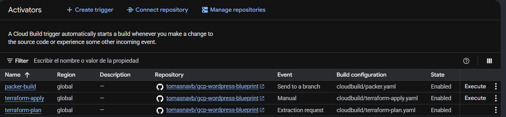
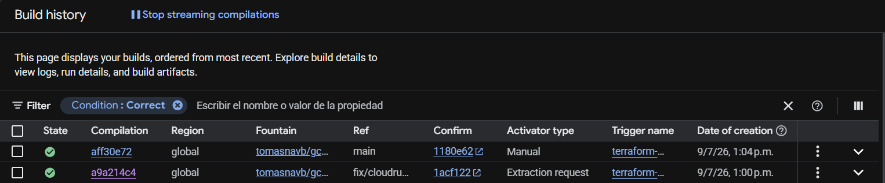
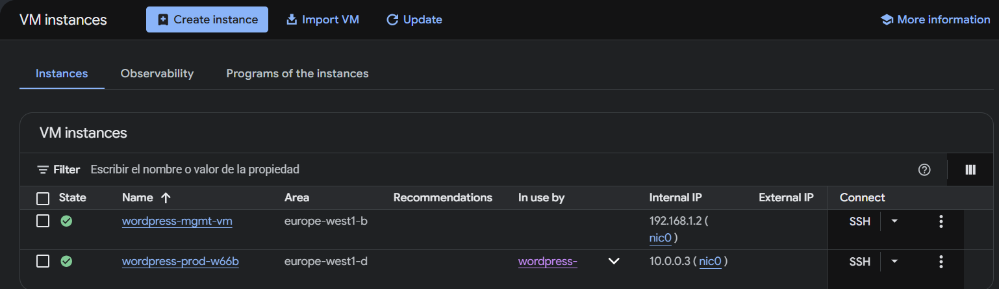
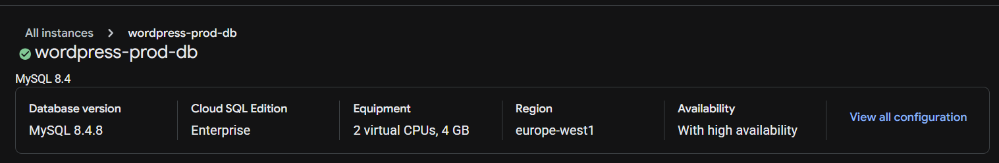
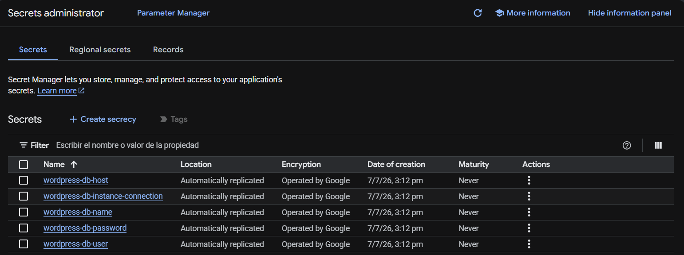
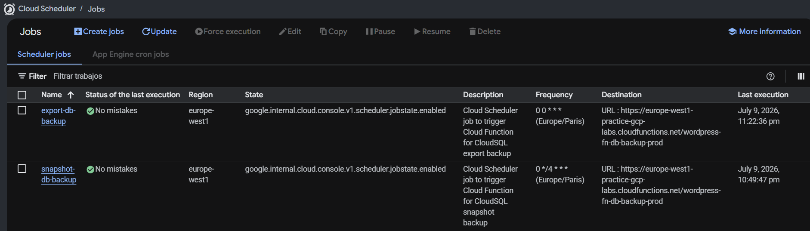
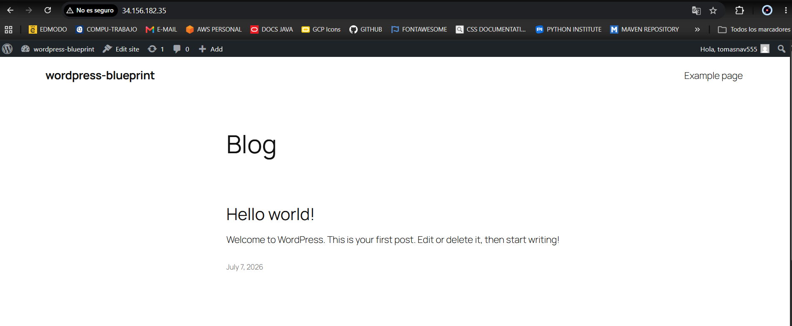

# WordPress on GCP — Infrastructure as Code


Production-grade WordPress infrastructure on Google Cloud Platform, fully provisioned with Terraform. Built as a portfolio project to demonstrate real-world cloud infrastructure engineering: network isolation, auto-healing compute, private database access, automated backups, and secrets management.

> **Note:** This is a portfolio project, not a production deployment. Some cost-optimized values (instance tier, disk size) differ from production recommendations documented in the code.

---

## Architecture


> **Outdated diagram:** it still shows the regional HTTP load balancer with its proxy-only subnet. The project now uses a global HTTPS load balancer, as described below. An updated diagram will replace it in the coming days.

### Overview

Traffic enters through a **Global External Application Load Balancer**, which terminates HTTPS with a Google-managed certificate and redirects HTTP to HTTPS, and reaches a **Regional Managed Instance Group** (MIG) of WordPress instances running in the production VPC. The MIG connects to **Cloud SQL (MySQL 8.4)** exclusively via private IP — no public database endpoint exists.

A separate **management VPC**, peered with the production VPC, hosts a management VM that reaches Cloud SQL through the **Cloud SQL Auth Proxy** for administrative tasks. SSH access to both VMs is exclusively through **Identity-Aware Proxy (IAP)** — no public IPs, no bastion hosts.

A **Cloud Function (v2)** triggered by **Cloud Scheduler** runs two automated backup strategies against Cloud SQL. Database credentials are stored in **Secret Manager** and read by the WordPress instances at startup.

---

## Key Design Decisions

### Regional MIG over Unmanaged Instance Group
The production workload uses a Regional Managed Instance Group with auto-healing, a named HTTP port for load balancer integration, and distribution across three zones (`europe-west1-b/c/d`). This provides zone-level fault tolerance and automatic instance replacement on health check failure — not achievable with a UMIG.

### Two-VPC Network Isolation
Production and management traffic are separated into two VPCs connected via VPC Peering. The production VPC handles all user-facing traffic; the management VPC is exclusively for administrative access. This limits the blast radius of a misconfiguration and reflects a real-world security boundary.

### Private IP for Cloud SQL
`ipv4_enabled = false` — the database has no public endpoint. Production instances connect via private IP within the same VPC. The management VM reaches it via VPC peering and Cloud SQL Auth Proxy. Private Service Access is configured for the service networking connection.

### IAP for SSH — No Public IPs, No Bastion
SSH access is granted through IAP tunnel access (`roles/iap.tunnelResourceAccessor`) to a specific operator email. No VM has an external IP address. No bastion host is required.

The operator email is not committed: it is passed to the pipeline as the `_IAP_USER_EMAIL` substitution and validated at plan time. In a production environment the binding would go to a Google group (`group:infra-admins@example.com`) instead of a user, so that team changes do not require a Terraform change.

### Global HTTPS Load Balancer with a Managed Certificate
The load balancer is global rather than regional because Google-managed SSL certificates, which Google issues and renews on its own, attach to the global external Application Load Balancer. The certificate is only issued once the DNS A record of the domain points to the load balancer IP, and that can take from 15 minutes to over an hour after the first deploy.

- **TLS ends at the load balancer.** Backends receive plain HTTP on port 80 inside the VPC. WordPress reads the `X-Forwarded-Proto` header the load balancer sets, so it knows the visitor is on HTTPS; without that it produces blocked `http://` assets and a redirect loop in the admin area. The block is baked into the image by `packer/scripts/install.sh`.
- **HTTP redirects to HTTPS.** A second forwarding rule on port 80, on the same IP, answers every request with a 301 to HTTPS.
- **Minimum TLS 1.2.** An SSL policy (`MODERN` profile) replaces the default one, which still accepts TLS 1.0.
- **One firewall rule for the Google front ends.** With a global load balancer, health check probes and proxied client traffic reach the backends from the same Google ranges (`35.191.0.0/16`, `130.211.0.0/22`). The rule lives in the load balancer module and targets only instances tagged `backend-service`.

### Reserved IP for the Load Balancer
A deploy that creates its own IP gets a different address every time, so the DNS record has to be updated and the certificate waits for DNS again. With `lb_use_reserved_ip = true` (the default) the load balancer uses a global IP reserved once by `configs/setup.sh`, outside Terraform. It survives `terraform destroy`, so the DNS record is set once.

A reserved IP is billed while no load balancer is using it. For a portfolio project that is torn down between tests, release it when a test session ends (see [Destroy](#destroy)), or set both `RESERVE_LB_IP` and `lb_use_reserved_ip` to `false` to let Terraform create and destroy the IP with the load balancer.

### Immutable Infrastructure with Packer
WordPress instances are deployed from a golden image built with Packer (`packer/wordpress.pkr.hcl`). The image includes WordPress, PHP, and all dependencies pre-installed. Terraform resolves the `wordpress-golden` image family to the concrete latest image on every plan, so a new build shows up as an instance template replacement and the MIG rolls it out.

The build VM has no external IP: Packer reaches it through an IAP tunnel in the management VPC, the same way an operator does.

### Two Backup Strategies
- **Export backup** (Cloud SQL export to GCS) — daily at midnight, 90-day retention via lifecycle rule. Full data portability.
- **Snapshot backup** (Cloud SQL backup run) — every 4 hours, 7-day retention. Fast point-in-time recovery.

Both are triggered by two Cloud Scheduler jobs invoking the same Cloud Function v2 with different payload types.

### Dedicated Build Identity for the Backup Function
A Cloud Function v2 involves three identities, and they are easy to confuse:

| Identity | What it does | In this project |
|---|---|---|
| Deployer | Creates the function | `terraform-cloud-build`, the pipeline service account |
| Build | Runs the Cloud Build that turns the source into a container image | `cloudsql-backup-fn-build-sa` |
| Runtime | Runs the function code | `cloudsql-backup-fn-sa` |

Left unset, the build identity is the Compute Engine default service account, which then needs broad roles added by hand. This project gives the build its own service account with three roles:

- `roles/logging.logWriter`, to write the build logs.
- `roles/artifactregistry.writer`, to push the image to the `gcf-artifacts` repository.
- `roles/storage.objectViewer`, to read the source.

Two details shaped how those roles are granted:

- **The build does not read the source from the bucket you upload it to.** Cloud Functions first copies the zip to a bucket it creates itself, `gcf-v2-sources-<project number>-<region>`, and builds from there. That bucket and the `gcf-artifacts` repository do not exist before the first deploy, so the roles cannot be bound on them beforehand and are granted at project level. An IAM condition limits the storage role to buckets named `gcf-v2-sources-*`; without it the build identity could read every bucket in the project, including the database exports.
- **IAM bindings take time to propagate.** Created in the same apply as the function, they are not effective yet when the build starts a few seconds later, and the build fails for lack of a permission that is already granted. A 120-second wait (`time_sleep`) sits between the bindings and the function.

### Secret Manager for Credentials
WordPress database credentials (`db-name`, `db-user`, `db-password`, `db-host`, `db-instance-connection`) are stored as secrets and read by the MIG instances at startup via the startup script. The production VM service account has `roles/secretmanager.secretAccessor` on each secret individually (least privilege).

---

## GCP Services

| Service | Purpose |
|---|---|
| Compute Engine (Regional MIG) | Auto-healing WordPress instances across 3 zones |
| Cloud SQL (MySQL 8.4) | Managed relational database, private IP only |
| Cloud Load Balancing | Global External Application LB: HTTPS with a Google-managed certificate, HTTP to HTTPS redirect, TLS 1.2 minimum |
| Cloud NAT + Cloud Router | Outbound internet access without public IPs |
| Identity-Aware Proxy | Zero-trust SSH access to management VM |
| VPC Network Peering | Private connectivity between prod and mgmt VPCs |
| Secret Manager | Database credentials storage and access |
| Cloud Functions v2 | Serverless backup orchestration |
| Cloud Scheduler | Automated backup triggers (cron) |
| Cloud Storage | Backup exports (90d) and function source code |
| Packer (HashiCorp) | Golden image build pipeline |

---

## Project Structure

```
gcp-wordpress-blueprint/
├── README.md
├── docs/
│   └── architecture.jpeg
│
├── configs/
│   └── setup.sh                     # One-time bootstrap: APIs, state bucket, load balancer IP, Cloud Build SA, IAM, triggers
│
├── cloudbuild/
│   ├── packer.yaml                  # Cloud Build pipeline: install pinned Packer, golden image build
│   ├── terraform-plan.yaml          # Cloud Build pipeline: init, fmt, validate, plan, destructive change report, artifact upload
│   ├── terraform-apply.yaml         # Cloud Build pipeline: init, download plan, destructive change check, apply
│   └── scripts/
│       └── check_destructive.py     # Reports destructive changes on plan; blocks them on apply unless explicitly allowed
│
├── packer/
│   ├── wordpress.pkr.hcl            # Packer template
│   ├── variables.pkr.hcl
│   └── scripts/
│       └── install.sh               # WordPress + PHP + Apache provisioning, HTTPS proxy config
│
└── terraform/
    ├── main.tf                      # Providers, backend (GCS, bucket via -backend-config)
    ├── terraform.tfvars             # Variable values (project_id and iap_user_email are passed by the pipeline)
    ├── .terraform.lock.hcl          # Provider version lock (committed for CI/CD consistency)
    ├── APIs.tf                      # GCP API enablement
    ├── compute.tf                   # Management VM + MIG + LB modules
    ├── database.tf                  # Cloud SQL instance, database, user
    ├── functions.tf                 # Cloud Function v2 + Cloud Scheduler modules
    ├── IAM.tf                       # Service accounts, roles, bindings
    ├── locals.tf                    # Shared locals (names, service account members, secrets map)
    ├── networking.tf                # VPC modules + VPC Peering
    ├── outputs.tf                   # Load balancer IP, site URLs, certificate name
    ├── private_service_access.tf    # Private Service Access for Cloud SQL
    ├── secrets.tf                   # Secret Manager secrets and versions
    ├── storage.tf                   # GCS buckets + Cloud Function source zip upload
    ├── variables_*.tf               # Variables split by domain
    ├── scripts/
    │   ├── startup-prod.sh          # MIG instance startup: fetch secrets, configure wp-config.php
    │   └── startup-mgmt.sh          # Management VM startup: install Cloud SQL Auth Proxy
    ├── functions/
    │   └── db-backup/
    │       ├── main.py              # Cloud Function: snapshot and export backup logic
    │       └── requirements.txt
    └── modules/
        ├── cloud_scheduler/         # Cloud Scheduler job with OIDC auth and retry policy
        ├── global_external_lb/      # Global IP, managed certificate, HTTPS and HTTP forwarding rules, backend service, firewall
        ├── mig/                     # Instance template, Regional MIG, autoscaler, health check
        └── networking/              # VPC, subnet, IAP firewall rule, Cloud Router, Cloud NAT
```

---

## Prerequisites

- A Google Cloud account with a billing account. The project itself is created in [Step 1](#step-1-create-the-gcp-project-and-enable-billing)
- A GitHub account with this repository forked or cloned
- A domain name whose DNS records you control (the managed certificate is issued for it)
- [Google Cloud SDK](https://cloud.google.com/sdk/docs/install) (for local operations)
- [Terraform](https://developer.hashicorp.com/terraform/install) >= 1.15.7 (only needed for local state operations)

The CI/CD pipeline runs entirely on **Cloud Build** — Terraform and Packer are not required locally for normal deployments.

---

## Deployment

The deployment is split into two phases: a one-time **bootstrap** that sets up Cloud Build, and a **CI/CD pipeline** for all subsequent infrastructure changes.

### Phase 1 — Bootstrap (one-time)

#### Step 1: Create the GCP project and enable billing

Everything below runs in [Cloud Shell](https://shell.cloud.google.com). The deployment needs its own project with a billing account linked: Compute Engine, Cloud SQL and Cloud Build cannot be enabled without one.

```bash
export PROJECT_ID="your-gcp-project-id"      # globally unique, 6 to 30 characters

gcloud projects create $PROJECT_ID --name="WordPress on GCP"
gcloud config set project $PROJECT_ID

# Link a billing account
gcloud billing accounts list
gcloud billing projects link $PROJECT_ID --billing-account=BILLING_ACCOUNT_ID
```

Both can also be done in the console: *IAM & Admin → Create a Project*, then *Billing → Link a billing account*. To use an existing project, export `PROJECT_ID` and skip the rest of this step.

Confirm billing is active before continuing:

```bash
gcloud billing projects describe $PROJECT_ID --format="value(billingEnabled)"   # must print True
```

> **Cost:** the environment is billed while it is up, mainly the regional Cloud SQL instance. See [Destroy](#destroy) to tear it down.

#### Step 2: Clone the repository in Cloud Shell

```bash
gh auth login
gh repo clone YOUR_GITHUB_USERNAME/gcp-wordpress-blueprint
cd gcp-wordpress-blueprint
```

#### Step 3: Set the deployment variables

`PROJECT_ID` is already exported from Step 1. Export the rest in the same shell. `configs/setup.sh` reads them, and the commands of the next steps use them too, so no file is edited with your own values:

```bash
export REPO_NAME="gcp-wordpress-blueprint"
export REPO_OWNER="your-github-username-or-org"
export IAP_USER_EMAIL="you@example.com"     # Google account granted SSH access through IAP
export RESERVE_LB_IP="true"                 # reserve a static IP for the load balancer (see below)
```

The script stops with an error if `PROJECT_ID` or any of the first three is missing.

Set your domain in `terraform/terraform.tfvars`:

```hcl
domain_names       = ["wordpress.example.com"]
lb_use_reserved_ip = true   # must match RESERVE_LB_IP
```

#### Step 4: Connect the GitHub repository to Cloud Build

This step requires OAuth authorization and **cannot** be done via `gcloud`. Do it manually:

> GCP Console → Cloud Build → Triggers → Connect Repository → GitHub

Once the repository is listed as connected, proceed to the next step.

#### Step 5: Run the bootstrap script

```bash
chmod +x configs/setup.sh
bash configs/setup.sh
```

This creates:
- Terraform state bucket (`PROJECT_ID-wordpress-terraform-state`) with versioning and 30-day plan artifact lifecycle
- Cloud Build service account (`terraform-cloud-build`) with all required IAM roles
- Four Cloud Build triggers: `packer-build`, `terraform-plan-pr`, `terraform-plan-main`, `terraform-apply`
- With `RESERVE_LB_IP=true`, a global static IP for the load balancer (`wordpress-prod-lb-ip-global-external-lb`)

The script prints the reserved IP. **Create a DNS A record for your domain pointing to it now**: the certificate cannot be issued until that record resolves, so the sooner it propagates the better.

---

### Phase 2 — First deploy

#### Step 6: Build the golden image (Packer)

Manually submit the Packer build (Cloud Build trigger fires automatically on future pushes to `packer/**`):

```bash
gcloud builds submit \
  --project=$PROJECT_ID \
  --config=cloudbuild/packer.yaml \
  --substitutions="_PROJECT_ID=$PROJECT_ID,_ZONE=europe-west1-b,_NETWORK=default,_SUBNETWORK=default,_USE_IAP=false" \
  --service-account="projects/${PROJECT_ID}/serviceAccounts/terraform-cloud-build@${PROJECT_ID}.iam.gserviceaccount.com"
```

> **Note:** This first build is the one exception to the "no public IPs" rule. The management VPC, its IAP firewall rule and the IAP API are created by Terraform, and Terraform needs the image to exist first. So the first build runs in the `default` network with `_USE_IAP=false`: the temporary build VM gets an external IP and Packer connects to it over SSH directly. The VM is deleted when the build ends.
>
> Every later build runs from the `packer-build` trigger with `_USE_IAP=true`: the build VM is created in `wordpress-mgmt-vpc` with no external IP and Packer connects through an IAP tunnel.

#### Step 7: Generate the Terraform plan

```bash
gcloud builds submit \
  --project=$PROJECT_ID \
  --config=cloudbuild/terraform-plan.yaml \
  --substitutions="_PROJECT_ID=$PROJECT_ID,_STATE_BUCKET=${PROJECT_ID}-wordpress-terraform-state,_IAP_USER_EMAIL=$IAP_USER_EMAIL,_SAVE_PLAN=true" \
  --service-account="projects/${PROJECT_ID}/serviceAccounts/terraform-cloud-build@${PROJECT_ID}.iam.gserviceaccount.com"
```

`_SAVE_PLAN=true` uploads the plan so it can be applied. The build output ends with the `BUILD_ID`. Copy it — you will need it in the next step.

> The plan is saved to `gs://PROJECT_ID-wordpress-terraform-state/plans/BUILD_ID/`.
> Review `plan.txt` before applying.

#### Step 8: Apply the plan

Replace `PLAN_BUILD_ID` with the ID from Step 7:

```bash
gcloud builds submit \
  --project=$PROJECT_ID \
  --config=cloudbuild/terraform-apply.yaml \
  --substitutions="_PROJECT_ID=$PROJECT_ID,_STATE_BUCKET=${PROJECT_ID}-wordpress-terraform-state,_PLAN_BUILD_ID=PLAN_BUILD_ID" \
  --service-account="projects/${PROJECT_ID}/serviceAccounts/terraform-cloud-build@${PROJECT_ID}.iam.gserviceaccount.com"
```

Once the apply completes, the last step prints the Terraform outputs: `load_balancer_ip`, `site_urls` and `ssl_certificate_name`.

If the IP was not reserved beforehand (`lb_use_reserved_ip = false`), create the DNS A record now with `load_balancer_ip`.

WordPress is not reachable right away. The instances need a few minutes to boot, and the managed certificate is issued only after Google sees the DNS record pointing to the load balancer, which takes from 15 minutes to over an hour. Until then browsers show an SSL error. Check progress with:

```bash
gcloud compute ssl-certificates describe SSL_CERTIFICATE_NAME \
  --project=$PROJECT_ID \
  --global \
  --format="value(managed.status, managed.domainStatus)"
```

| Status | Meaning |
|---|---|
| `PROVISIONING` | Being issued. Normal after a deploy |
| `ACTIVE` | Issued. The site is available at the URLs in `site_urls` |
| `FAILED_NOT_VISIBLE` | Google does not see the DNS record pointing to the load balancer IP |

---

### CI/CD flow (ongoing changes)

What is deployed always comes from `main`: a pull request is reviewed with a plan, but only the plan generated after the merge can be applied.

| Event | Trigger | What runs |
|---|---|---|
| Pull Request targeting `main` | `terraform-plan-pr` (automatic) | `cloudbuild/terraform-plan.yaml` — plan for review. Not saved, cannot be applied |
| Push to `main` with changes in `terraform/**` | `terraform-plan-main` (automatic) | `cloudbuild/terraform-plan.yaml` — same plan, saved to the state bucket |
| Manual run after reviewing the saved plan | `terraform-apply` (manual, requires approval) | `cloudbuild/terraform-apply.yaml` — destructive change check, then apply |
| Push to `main` with changes in `packer/**` | `packer-build` (automatic) | `cloudbuild/packer.yaml` — builds a new golden image |

**To apply the plan generated on `main`**, use the `BUILD_ID` of the `terraform-plan-main` run:

```bash
gcloud beta builds triggers run terraform-apply \
  --project=$PROJECT_ID \
  --branch=main \
  --substitutions=_PLAN_BUILD_ID=PLAN_BUILD_ID_FROM_MAIN
```

A saved plan goes stale as soon as the state changes: if two pull requests are merged in a row, Terraform only accepts the most recent plan.

#### Destructive changes

Both plan triggers list every resource the plan would destroy or replace, without failing. The check is enforced at apply time, on the exact plan being applied:

| Plan contains | Apply result |
|---|---|
| No destroy or replace | Applies |
| Replace of an instance template or an IAM binding | Applies — routine, no data involved |
| Any other destroy or replace | Rejected unless `_ALLOW_DESTRUCTIVE=true` is passed |
| Destroy or replace of the Cloud SQL instance, its database or the backup bucket | Always rejected |

To apply a plan with destructive changes after reviewing them:

```bash
gcloud beta builds triggers run terraform-apply \
  --project=$PROJECT_ID \
  --branch=main \
  --substitutions=_PLAN_BUILD_ID=PLAN_BUILD_ID_FROM_MAIN,_ALLOW_DESTRUCTIVE=true
```

The protected resources are listed in [cloudbuild/scripts/check_destructive.py](cloudbuild/scripts/check_destructive.py). The flag does not override them; removing one from the list takes a reviewed commit.

---

### Destroy

The pipeline cannot destroy the environment: the database and the backup bucket are protected. Tear it down locally:

```bash
cd terraform
mkdir -p tmp
terraform init -backend-config="bucket=${PROJECT_ID}-wordpress-terraform-state"
export TF_VAR_project_id=$PROJECT_ID
export TF_VAR_iap_user_email=$IAP_USER_EMAIL
terraform destroy
```

`terraform destroy` does not release the reserved load balancer IP, because it is not managed by Terraform. Keep it to redeploy later without touching DNS, or release it to stop paying for it:

```bash
gcloud compute addresses delete wordpress-prod-lb-ip-global-external-lb \
  --project=$PROJECT_ID \
  --global
```

> **Portfolio note:** `deletion_protection` and `prevent_destroy` are set to `false` in this project to allow easy teardown during testing. In a production environment both should be set to `true` in [terraform/database.tf](terraform/database.tf).

---

## Operations

### SSH access via IAP

```bash
# Management VM
gcloud compute ssh wordpress-mgmt-vm \
  --zone=europe-west1-b \
  --project=YOUR_PROJECT_ID \
  --tunnel-through-iap

# Production instance (MIG)
gcloud compute ssh INSTANCE_NAME \
  --zone=ZONE \
  --project=YOUR_PROJECT_ID \
  --tunnel-through-iap
```

### Trigger a manual backup

```bash
# Snapshot (fast, seconds)
gcloud functions call wordpress-fn-db-backup-prod \
  --region=europe-west1 \
  --project=YOUR_PROJECT_ID \
  --data='{"type": "snapshot"}'

# Export to GCS (full SQL dump)
gcloud functions call wordpress-fn-db-backup-prod \
  --region=europe-west1 \
  --project=YOUR_PROJECT_ID \
  --data='{"type": "export"}'
```

View snapshots:

```bash
gcloud sql backups list --instance=wordpress-prod-db --project=YOUR_PROJECT_ID
```

View exports:

```bash
gcloud storage ls gs://wordpress-db-backups-YOUR_PROJECT_ID/exports/
```

### Update the WordPress image

1. Modify provisioning scripts in `packer/scripts/`
2. Merge to `main` — the `packer-build` trigger fires automatically and registers a new image under the `wordpress-golden` family (10-15 minutes)
3. When the build has finished, generate a plan. A change in `packer/**` alone does not trigger one:

   ```bash
   gcloud builds triggers run terraform-plan-main \
     --project=$PROJECT_ID \
     --branch=main
   ```

   The plan shows the instance template being replaced with the new image.
4. Apply that plan with `terraform-apply` — the MIG rolling update replaces the instances. An instance template replacement does not need `_ALLOW_DESTRUCTIVE=true`

---

## Modules

| Module | Description |
|---|---|
| `modules/networking` | VPC network, subnet, IAP SSH firewall rule, Cloud Router, Cloud NAT. All feature flags (`enable_nat`, `allow_ssh_from_iap`) are passed by the caller with no module-level defaults. |
| `modules/mig` | Instance template (Packer golden image), Regional MIG with distribution policy, global health check for auto-healing, and regional autoscaler with scale-in controls. |
| `modules/global_external_lb` | Global external Application Load Balancer: IP address (created or reserved beforehand), Google-managed SSL certificate, SSL policy, HTTPS forwarding rule, HTTP forwarding rule that redirects to HTTPS, backend service wired to the MIG, health check, and the firewall rule that lets the Google front ends reach the backends. |
| `modules/cloud_scheduler` | Cloud Scheduler job with OIDC-authenticated HTTP target, configurable retry policy, and cron schedule. Reused for both export and snapshot backup jobs. |

---

## Security Highlights

- No VM has a public IP address
- HTTPS only: Google-managed certificate, HTTP redirected to HTTPS, TLS 1.2 minimum
- Backends accept traffic only from the Google front end ranges, not from the internet
- Cloud SQL is accessible only via private IP within the VPC
- SSH access exclusively through IAP (no open port 22 to the internet)
- Database credentials stored in Secret Manager, never in environment variables or files
- `project_id` and the operator email excluded from version control — passed as Cloud Build substitutions (`TF_VAR_project_id`, `TF_VAR_iap_user_email`)
- Cloud SQL instance has `deletion_protection` and `prevent_destroy` set to `false` for portfolio teardown convenience (set to `true` in production)
- Least-privilege service accounts per workload (VM, function, scheduler)
- Custom IAM role for the backup function with only the required Cloud SQL permissions

---

## Screenshots

### Cloud Build — Triggers



### Cloud Build — Terraform Plan (successful)



### Compute Engine — VM Instances (MIG)



### Cloud SQL — Instance



### Secret Manager — Secrets



### Cloud Scheduler — Backup Jobs



### WordPress — Online via Load Balancer



---

## Roadmap

Features not implemented in this version but planned as natural next steps:

- **Cloud Monitoring & Alerting** — uptime checks on the load balancer IP, alert policies for Apache error rate and instance health, Cloud Ops Agent for OS-level and Apache metrics (requests/s, latency, error rate)
- **Cloud Armor** — WAF rules and DDoS protection in front of the load balancer
- **Cloud CDN** — enable caching at the load balancer level for static WordPress assets
- **Terraform tests** — infrastructure validation using `terraform test` or Terratest
- **Multi-region failover** — promote the Cloud SQL read replica to a second region and extend the MIG distribution policy
