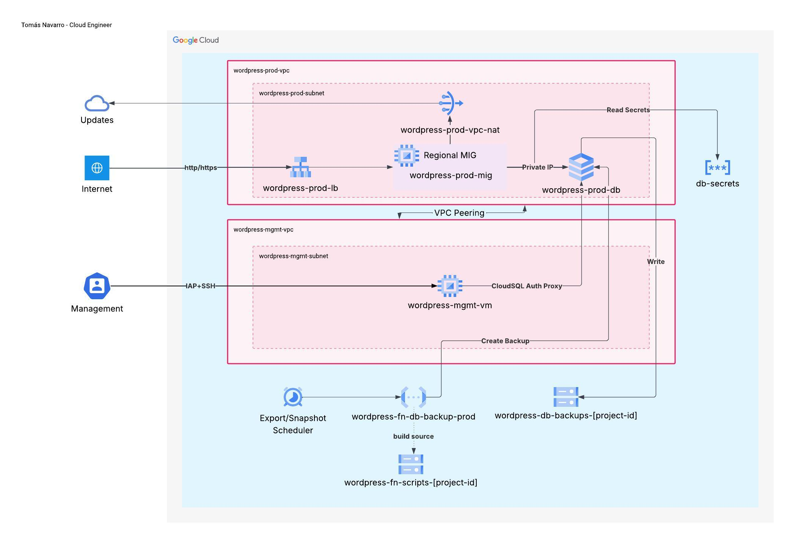

# WordPress on GCP — Infrastructure as Code


Production-grade WordPress infrastructure on Google Cloud Platform, fully provisioned with Terraform. Built as a portfolio project to demonstrate real-world cloud infrastructure engineering: network isolation, auto-healing compute, private database access, automated backups, and secrets management.

> **Note:** This is a portfolio project, not a production deployment. Some cost-optimized values (instance tier, disk size) differ from production recommendations documented in the code.

---

## Architecture



### Overview

Traffic enters through a **Regional External Application Load Balancer** and reaches a **Regional Managed Instance Group** (MIG) of WordPress instances running in the production VPC. The MIG connects to **Cloud SQL (MySQL 8.4)** exclusively via private IP — no public database endpoint exists.

A separate **management VPC**, peered with the production VPC, hosts a management VM that reaches Cloud SQL through the **Cloud SQL Auth Proxy** for administrative tasks. SSH access to both VMs is exclusively through **Identity-Aware Proxy (IAP)** — no public IPs, no bastion hosts.

A **Cloud Function (v2)** triggered by **Cloud Scheduler** runs two automated backup strategies against Cloud SQL. Database credentials are stored in **Secret Manager** and read by the WordPress instances at startup.

---

## Key Design Decisions

### Regional MIG over Unmanaged Instance Group
The production workload uses a Regional Managed Instance Group with auto-healing, a named HTTP port for load balancer integration, and distribution across three zones (`europe-west1-b/c/d`). This provides zone-level fault tolerance and automatic instance replacement on health check failure — not achievable with a UMIG.

### Two-VPC Network Isolation
Production and management traffic are separated into two VPCs connected via VPC Peering. The production VPC handles all user-facing traffic; the management VPC is exclusively for administrative access. This limits the blast radius of a misconfiguration and reflects a real-world security boundary.

### Private IP for Cloud SQL
`ipv4_enabled = false` — the database has no public endpoint. Production instances connect via private IP within the same VPC. The management VM reaches it via VPC peering and Cloud SQL Auth Proxy. Private Service Access is configured for the service networking connection.

### IAP for SSH — No Public IPs, No Bastion
SSH access is granted through IAP tunnel access (`roles/iap.tunnelResourceAccessor`) to a specific operator email. No VM has an external IP address. No bastion host is required.

### Immutable Infrastructure with Packer
WordPress instances are deployed from a golden image built with Packer (`packer/wordpress.pkr.hcl`). The image includes WordPress, PHP, and all dependencies pre-installed. The MIG instance template references this image family — updates are rolled out by building a new image and triggering a rolling update.

### Two Backup Strategies
- **Export backup** (Cloud SQL export to GCS) — daily at midnight, 90-day retention via lifecycle rule. Full data portability.
- **Snapshot backup** (Cloud SQL backup run) — every 4 hours, 7-day retention. Fast point-in-time recovery.

Both are triggered by two Cloud Scheduler jobs invoking the same Cloud Function v2 with different payload types.

### Secret Manager for Credentials
WordPress database credentials (`db-name`, `db-user`, `db-password`, `db-host`, `db-instance-connection`) are stored as secrets and read by the MIG instances at startup via the startup script. The production VM service account has `roles/secretmanager.secretAccessor` on each secret individually (least privilege).

---

## GCP Services

| Service | Purpose |
|---|---|
| Compute Engine (Regional MIG) | Auto-healing WordPress instances across 3 zones |
| Cloud SQL (MySQL 8.4) | Managed relational database, private IP only |
| Cloud Load Balancing | Regional External Application LB with proxy-only subnet |
| Cloud NAT + Cloud Router | Outbound internet access without public IPs |
| Identity-Aware Proxy | Zero-trust SSH access to management VM |
| VPC Network Peering | Private connectivity between prod and mgmt VPCs |
| Secret Manager | Database credentials storage and access |
| Cloud Functions v2 | Serverless backup orchestration |
| Cloud Scheduler | Automated backup triggers (cron) |
| Cloud Storage | Backup exports (90d) and function source code |
| Packer (HashiCorp) | Golden image build pipeline |

---

## Project Structure

```
wordpress_site/
├── packer/                          # Golden image build
│   ├── wordpress.pkr.hcl            # Packer template
│   ├── variables.pkr.hcl
│   └── scripts/                     # Provisioning scripts
│
└── terraform/
    ├── main.tf                      # Providers, backend (GCS)
    ├── terraform.tfvars             # Variable values
    ├── APIs.tf                      # GCP API enablement
    ├── compute.tf                   # Management VM + MIG + LB modules
    ├── database.tf                  # Cloud SQL instance, database, user
    ├── functions.tf                 # Cloud Function + Scheduler modules
    ├── IAM.tf                       # Service accounts, roles, bindings
    ├── locals.tf                    # Shared locals (names, roles, secrets map)
    ├── networking.tf                # VPC modules + VPC Peering
    ├── outputs.tf
    ├── private_service_access.tf    # Private Service Access for Cloud SQL
    ├── secrets.tf                   # Secret Manager resources
    ├── storage.tf                   # GCS buckets + function source upload
    ├── variables_*.tf               # Variables split by domain
    └── modules/
        ├── cloud_scheduler/         # Cloud Scheduler job
        ├── external_lb/             # Regional External Application LB
        ├── mig/                     # Instance template + Regional MIG + Autoscaler
        └── networking/              # VPC, subnet, firewall rules, Cloud NAT
```

---

## Prerequisites

- A GCP project with billing enabled
- A GitHub account with this repository forked or cloned
- [Google Cloud SDK](https://cloud.google.com/sdk/docs/install) (for local operations)
- [Terraform](https://developer.hashicorp.com/terraform/install) >= 1.15.7 (only needed for local state operations)

The CI/CD pipeline runs entirely on **Cloud Build** — Terraform and Packer are not required locally for normal deployments.

---

## Deployment

The deployment is split into two phases: a one-time **bootstrap** that sets up Cloud Build, and a **CI/CD pipeline** for all subsequent infrastructure changes.

### Phase 1 — Bootstrap (one-time)

#### Step 1: Clone the repository in Cloud Shell

```bash
gh auth login
gh repo clone YOUR_GITHUB_USERNAME/gcp-wordpress-blueprint
cd gcp-wordpress-blueprint
```

#### Step 2: Configure `configs/setup.sh`

Edit the variables at the top of the file:

```bash
export PROJECT_ID="your-gcp-project-id"
export REPO_NAME="gcp-wordpress-blueprint"
export REPO_OWNER="your-github-username-or-org"
```

#### Step 3: Connect the GitHub repository to Cloud Build

This step requires OAuth authorization and **cannot** be done via `gcloud`. Do it manually:

> GCP Console → Cloud Build → Triggers → Connect Repository → GitHub

Once the repository is listed as connected, proceed to the next step.

#### Step 4: Run the bootstrap script

```bash
chmod +x configs/setup.sh
bash configs/setup.sh
```

This creates:
- Terraform state bucket (`PROJECT_ID-wordpress-terraform-state`) with versioning and 30-day plan artifact lifecycle
- Cloud Build service account (`terraform-cloud-build`) with all required IAM roles
- Three Cloud Build triggers: `packer-build`, `terraform-plan`, `terraform-apply`

---

### Phase 2 — First deploy

#### Step 5: Build the golden image (Packer)

Manually submit the Packer build (Cloud Build trigger fires automatically on future pushes to `packer/**`):

```bash
gcloud builds submit \
  --project=$PROJECT_ID \
  --config=cloudbuild/packer.yaml \
  --substitutions="_PROJECT_ID=$PROJECT_ID,_ZONE=europe-west1-b,_NETWORK=default,_SUBNETWORK=default" \
  --service-account="projects/${PROJECT_ID}/serviceAccounts/terraform-cloud-build@${PROJECT_ID}.iam.gserviceaccount.com"
```

> **Note:** The first Packer build uses the `default` network because the management VPC does not exist yet. After the first `terraform apply`, the trigger will use `wordpress-mgmt-vpc` automatically.

#### Step 6: Generate the Terraform plan

```bash
gcloud builds submit \
  --project=$PROJECT_ID \
  --config=cloudbuild/terraform-plan.yaml \
  --substitutions="_PROJECT_ID=$PROJECT_ID,_STATE_BUCKET=${PROJECT_ID}-wordpress-terraform-state,_ALLOW_DESTRUCTIVE_CHANGES=false" \
  --service-account="projects/${PROJECT_ID}/serviceAccounts/terraform-cloud-build@${PROJECT_ID}.iam.gserviceaccount.com"
```

The build output ends with the `BUILD_ID`. Copy it — you will need it in the next step.

> The plan is saved to `gs://PROJECT_ID-wordpress-terraform-state/plans/BUILD_ID/`.
> Review `plan.txt` before applying.

#### Step 7: Apply the plan

Replace `PLAN_BUILD_ID` with the ID from Step 6:

```bash
gcloud builds submit \
  --project=$PROJECT_ID \
  --config=cloudbuild/terraform-apply.yaml \
  --substitutions="_PROJECT_ID=$PROJECT_ID,_STATE_BUCKET=${PROJECT_ID}-wordpress-terraform-state,_PLAN_BUILD_ID=PLAN_BUILD_ID" \
  --service-account="projects/${PROJECT_ID}/serviceAccounts/terraform-cloud-build@${PROJECT_ID}.iam.gserviceaccount.com"
```

Once the apply completes, the Load Balancer IP is shown in the Terraform outputs. WordPress will be available at `http://LB_IP` within a few minutes (startup script runs on first boot).

---

### CI/CD flow (ongoing changes)

| Event | Trigger | What runs |
|---|---|---|
| Push to `main` with changes in `packer/**` | Automatic | `cloudbuild/packer.yaml` — builds a new golden image |
| Pull Request targeting `main` | Automatic | `cloudbuild/terraform-plan.yaml` — plan + destructive change check |
| Manual approval after plan review | Manual | `cloudbuild/terraform-apply.yaml` — applies the reviewed plan |

**To apply a plan generated by a PR trigger:**

```bash
gcloud beta builds triggers run terraform-apply \
  --project=$PROJECT_ID \
  --branch=main \
  --substitutions=_PLAN_BUILD_ID=PLAN_BUILD_ID_FROM_PR
```

> Destructive changes (resource replace or destroy) are blocked by default. To override, set `_ALLOW_DESTRUCTIVE_CHANGES=true` in the plan substitutions and re-run.

---

### Destroy

`deletion_protection` and `prevent_destroy` are enabled on the Cloud SQL instance. To destroy the environment:

1. Set `deletion_protection = false` and remove the `prevent_destroy` lifecycle block in [terraform/database.tf](terraform/database.tf)
2. Run a plan and apply with `_ALLOW_DESTRUCTIVE_CHANGES=true`

---

## Operations

### SSH access via IAP

```bash
# Management VM
gcloud compute ssh wordpress-mgmt-vm \
  --zone=europe-west1-b \
  --project=YOUR_PROJECT_ID \
  --tunnel-through-iap

# Production instance (MIG)
gcloud compute ssh INSTANCE_NAME \
  --zone=ZONE \
  --project=YOUR_PROJECT_ID \
  --tunnel-through-iap
```

### Trigger a manual backup

```bash
# Snapshot (fast, seconds)
gcloud functions call wordpress-fn-db-backup-prod \
  --region=europe-west1 \
  --project=YOUR_PROJECT_ID \
  --data='{"type": "snapshot"}'

# Export to GCS (full SQL dump)
gcloud functions call wordpress-fn-db-backup-prod \
  --region=europe-west1 \
  --project=YOUR_PROJECT_ID \
  --data='{"type": "export"}'
```

View snapshots:

```bash
gcloud sql backups list --instance=wordpress-prod-db --project=YOUR_PROJECT_ID
```

View exports:

```bash
gcloud storage ls gs://wordpress-db-backups-YOUR_PROJECT_ID/exports/
```

### Update the WordPress image

1. Modify provisioning scripts in `packer/scripts/`
2. Push to `main` — the `packer-build` trigger fires automatically
3. Once the new image is registered under the `wordpress-golden` family, run a Terraform plan and apply — the MIG rolling update replaces instances with the new image

---

## Modules

| Module | Description |
|---|---|
| `modules/networking` | VPC network, subnet, IAP/LB firewall rules, Cloud Router, Cloud NAT. All feature flags (`enable_nat`, `allow_external_lb`, `allow_ssh_from_iap`) are passed by the caller with no module-level defaults. |
| `modules/mig` | Instance template (Packer golden image), Regional MIG with distribution policy, global health check for auto-healing, and regional autoscaler with scale-in controls. |
| `modules/external_lb` | Proxy-only subnet, reserved external IP, forwarding rule, URL map, HTTP proxy, regional health check, and backend service wired to the MIG. |
| `modules/cloud_scheduler` | Cloud Scheduler job with OIDC-authenticated HTTP target, configurable retry policy, and cron schedule. Reused for both export and snapshot backup jobs. |

---

## Security Highlights

- No VM has a public IP address
- Cloud SQL is accessible only via private IP within the VPC
- SSH access exclusively through IAP (no open port 22 to the internet)
- Database credentials stored in Secret Manager, never in environment variables or files
- `project_id` excluded from version control — set via `TF_VAR_project_id`
- Cloud SQL instance has `deletion_protection = true` and `prevent_destroy = true`
- Least-privilege service accounts per workload (VM, function, scheduler)
- Custom IAM role for the backup function with only the required Cloud SQL permissions
